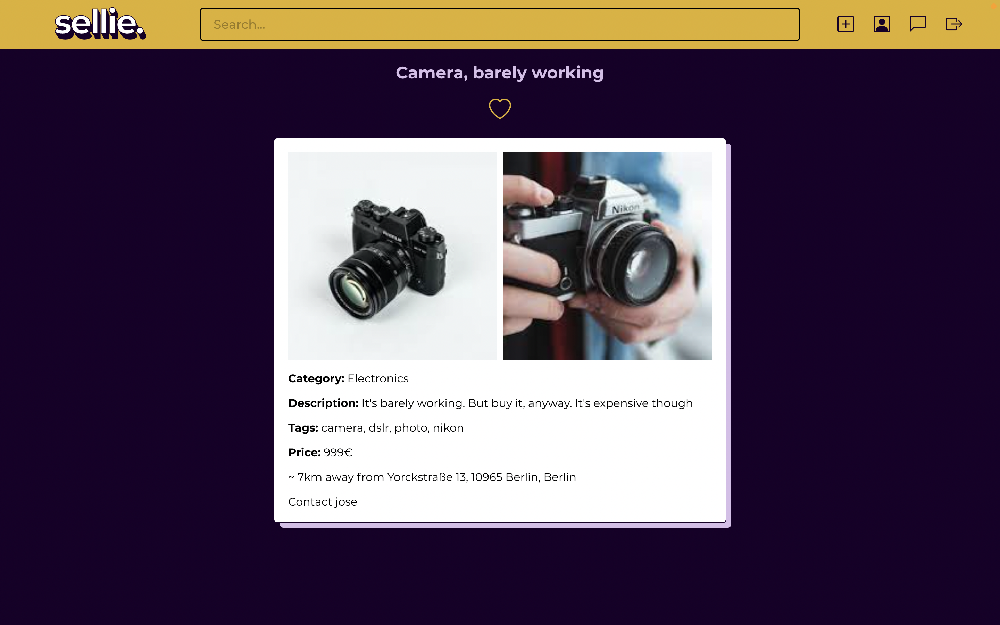

The third project of the Ironhack Web Development Bootcamp.
Made by Aljoscha Zynga

# sellie
An online platform for selling used items, built with ReactJS, Express.js, MongoDB and Socket.io. It includes a geolocation based search function with different filter and sort options, and fully working private chats between users.

https://sellie.netlify.app/

